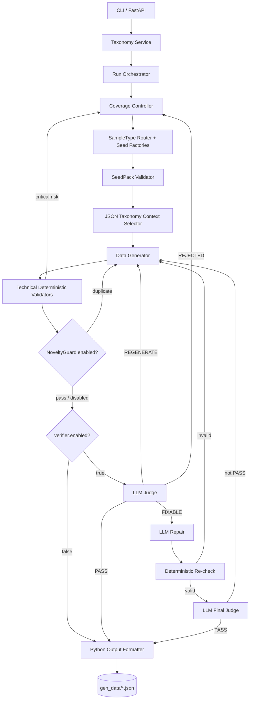

# PII Data Factory v2

## 1. Tổng quan

PII Data Factory tạo dữ liệu PII tổng hợp phục vụ huấn luyện và kiểm thử mô hình
Named Entity Recognition. Luồng hiện tại là một modular monolith chạy từ CLI hoặc
FastAPI: đọc taxonomy, lập kế hoạch sample, sinh dữ liệu bằng Azure OpenAI, kiểm tra
deterministic và xuất JSON có offset. NoveltyGuard cùng LLM Judge/Repair là quality
checks độc lập; config mẫu bật Gemini 2.5 Pro Judge cho mọi candidate online.
Offline chỉ là smoke test và không được dùng làm dataset.

Hệ thống không sử dụng Faker để sinh positive entity. Value được chọn bằng Python
từ Value Bank ba ngôn ngữ; Generator chỉ viết nội dung và placeholder skeleton.

## 2. Phạm vi đã triển khai



Luồng quality-first của config mẫu:

```text
Generator
  → Technical Deterministic Validators
  → Gemini 2.5 Pro Judge
  → optional Repair + re-check + final Judge
  → Python Output Formatter
  → gen_data
```

`verifier.enabled` điều khiển Judge/Repair. Cờ legacy
`validation.quality_checks_enabled` được migrate sang `novelty.enabled` và
`verifier.enabled` riêng rẽ khi config cũ chưa khai báo section mới tương ứng.
Dù Novelty/Judge tắt, Formatter không bao giờ được bỏ qua technical validation.

## 3. Các module

### 3.1 Entry point và API

Các file chính:

- `pii_factory/main.py`: CLI, import taxonomy JSON và chạy đến khi run hoàn tất.
- `pii_factory/api.py`: FastAPI.
- `pii_factory/bootstrap.py`: nối các service và infrastructure adapter.

Các endpoint hiện có:

```text
GET  /
GET  /health
GET  /api/v1/taxonomies
GET  /api/v1/taxonomies/{version_id}
POST /api/v1/runs
POST /api/v1/taxonomies/{version_id}/runs
GET  /api/v1/runs/{run_id}
GET  /api/v1/runs/{run_id}/tasks
POST /api/v1/runs/{run_id}/generate?limit=5
GET  /api/v1/runs/{run_id}/events
```

Khi API khởi động, taxonomy canonical được đọc từ `PII_TAXONOMY_PATH` hoặc
`pii_taxonomy_rules.json`. `POST /api/v1/runs` nhận trực tiếp `RunConfig` và dùng
taxonomy version mặc định này.

`limit` là số sample đã accept cần trả về, không phải số request LLM tối đa. Một
sample có thể cần nhiều Generator attempt và, khi Verifier bật, nhiều Verifier
call.

Lỗi hạ tầng Verifier trả HTTP `503` mà không tiêu hao Generator attempt khi quality
gate được bật.

### 3.2 Taxonomy Service

`pii_factory/application/taxonomy_service.py`:

- đăng ký snapshot taxonomy có version;
- kiểm tra label của run;
- trả definition, rule và examples đúng cho task;
- phát event liên quan đến taxonomy.

`pii_factory/infrastructure/json_taxonomy.py` dùng Pydantic đọc trực tiếp
`pii_taxonomy_rules.json`. File này là nguồn taxonomy runtime duy nhất và hiện có
44 label; mỗi label phải có ít nhất ba example cho từng nhóm `POSITIVE`,
`PURE_NEGATIVE` và `HARD_NEGATIVE`.

Mỗi label còn có `DECOY_BLUEPRINTS`. Một blueprint lưu `source_example_ids`,
`family`, `contrast_principle`, các surface/cue, context/structure tương thích và
quan hệ tích hợp. Parser từ chối blueprint tham chiếu example không tồn tại trong
`EXAMPLES.HARD_NEGATIVE` của chính label; nếu label khai báo blueprint thì phải có
ít nhất ba blueprint và ít nhất hai blueprint phi kỹ thuật.

Label từ tài liệu hard-negative bên ngoài không được thêm vào hệ thống. Chỉ label có
trong taxonomy snapshot của run được sử dụng.

### 3.3 Coverage Controller

`CoverageController` tạo `GenerationTask` theo:

- difficulty distribution;
- sample type distribution;
- optional constraints;
- exact seeded quota cho `short/medium/long`;
- sample structure được random có seed từ pool cấu hình;
- focus label và robin labels;
- entity/complexity limits;
- deterministic `random_seed`.

Preset độ dài:

| Structure | short | medium | long |
|---|---:|---:|---:|
| Contract | 80–120 từ, 3–5 content units | 150–230 từ, 6–9 units | 260–400 từ, 10–14 units |
| Chat | 80–120 từ, 6–8 lượt | 150–230 từ, 10–14 lượt | 260–400 từ, 16–22 lượt |
| Custom | 80–120 từ | 150–230 từ | 260–400 từ |

Các khoảng trên là mục tiêu để Generator hướng tới. Validator chỉ enforce cận dưới
`80/150/260`; sample dài hơn cận trên vẫn hợp lệ và không bị regenerate.

Planner dùng largest-remainder quota rồi shuffle bằng `random_seed`; với 10 mẫu và
distribution `0.2/0.5/0.3`, quota luôn là `2/5/3`.

Mỗi task ban đầu có `slot_no`. Nếu task hết Generator attempt, task thay thế:

- giữ nguyên `slot_no`;
- giữ focus labels, difficulty, sample type và constraints;
- nhận task ID, seed và context mới;
- tăng `replacement_no`.

Run chỉ `COMPLETED` khi mỗi slot có một sample `ACCEPTED`.

### 3.4 Value Bank và seed generation

`SampleTypeRouter` chọn factory:

- `positive`: lấy positive seed từ Value Bank theo `task.language` và label;
- `pure_negative`: dùng vocabulary an toàn, không có positive PII;
- `hard_negative/decoy_only`: chỉ có decoy không gắn tag;
- `hard_negative/mixed_contrastive`: có positive PII và decoy dễ nhầm.

Riêng `mixed_contrastive`,
`pii_factory/application/mixed_decoy_planner.py` chọn đồng thời:

```text
(context frame, taxonomy decoy blueprint, positive anchor, integration relation)
```

Planner ưu tiên family `semantic_ambiguity/business_reference/operational_code`
và dành khoảng 10% slot phù hợp cho `technical_schema`, luôn bị chặn bởi
`hard_negative.technical_decoy_max_ratio`. Blueprint kỹ thuật chỉ được dùng trong
domain kỹ thuật/data/system tương thích. Retry scope `CONTEXT` giữ blueprint và chỉ
đổi sang frame tương thích; retry scope `SEEDS` chọn lại seed và blueprint.

`ValueBankEntityProvider` đọc lazy và cache file được khai báo tại
`value_bank.language_files[language]`. Tên file tương đối được resolve từ
`value_bank.path`; đường dẫn tuyệt đối cũng được hỗ trợ. Mapping mặc định là
`vi_pii_value_pools.json`, `en_pii_value_pools.json` và
`de_pii_value_pools.json`. Mỗi file phải có `version: 1`, object
`entity_values`, class hợp lệ, danh sách không rỗng, item `value` không rỗng và
`locale` khớp ngôn ngữ được yêu cầu.

Thư mục `PII_Value_Bank/` là runtime data local-only, được liệt kê trong
`.gitignore` và không được phân phối qua repository này. Sau khi clone, người vận
hành phải tự tạo/copy các file Value Bank tương ứng vào path đã cấu hình. Runtime
sẽ fail-fast với lỗi rõ ràng nếu directory, language file hoặc label pool bị thiếu.

Ví dụ cấu hình English:

```json
{
  "language": "en",
  "value_bank": {
    "path": "PII_Value_Bank",
    "language_files": {
      "vi": "vi_pii_value_pools.json",
      "en": "en_pii_value_pools.json",
      "de": "de_pii_value_pools.json"
    }
  }
}
```

Thiếu key ngôn ngữ trong `language_files` là lỗi cấu hình rõ ràng, không tự suy đoán
tên file và không fallback sang Faker.

Provider dùng đúng instance `random.Random` đã seed bằng `task.random_seed`.
Mọi entry trong file đều được giữ nguyên trong bộ nhớ, kể cả duplicate và các biến
thể chỉ khác hoa/thường. Khi một sample có nhiều entity, factory chỉ loại chuỗi đã
chọn nếu chuỗi mới giống hoàn toàn; `Visa`, `VISA` và `visa` vẫn là các value khác
nhau. Thiếu directory/language/class, class rỗng, JSON lỗi, version sai hoặc locale
sai đều tạo `value_bank_error` scope `SEEDS` và dừng retry vô ích.

Riêng khi chọn `ADDRESS`, provider loại khỏi tập sampling những source có hậu tố
phân tách bằng dấu phẩy trùng với một value trong pool `LOCATION`. File Value Bank
không bị sửa; đây là boundary gate để địa chỉ đường/tòa/phòng không nuốt quận,
tỉnh hoặc thành phố.

`SeedPackValidator` kiểm tra:

- label thuộc taxonomy;
- positive value không trùng chính xác trong cùng completion; khác hoa/thường được
  xem là value khác;
- seed ngoài Value Bank vẫn qua format/mixed-locale checks cũ;
- seed từ Value Bank phải mang `format_variant=value_bank`, sau khi file đã được
  provider validate;
- decoy strategy tồn tại;
- taxonomy decoy khớp blueprint và `realization_plan`;
- decoy không va chạm positive seed hoặc label cấu trúc khác;
- required/forbidden context cues.

PERSON được lấy nguyên văn từ đúng class và language trong Value Bank; không dùng
Faker name. Quy tắc taxonomy phân tách địa chỉ như sau:

- `ADDRESS`: số nhà, đường, tòa, căn hộ hoặc phòng;
- `LOCATION`: phường, quận/huyện, tỉnh/thành phố hoặc quốc gia;
- `ZIP_CODE`: span bưu chính độc lập.

### 3.5 JSON Taxonomy Context Selector

`pii_factory/application/taxonomy_context.py` tạo context có cấu trúc cho từng task:

- label neo nhận `definition`, `rule` và đúng ba example tương ứng với
  `task.sample_type` đã được random;
- robin labels chỉ nhận `definition` và `rule`;
- trong `mixed_contrastive`, chỉ label thực sự được chọn làm decoy target mới nhận
  đúng ba `HARD_NEGATIVE` examples kèm rationale trong `decoy_labels`;
- example được blueprint tham chiếu qua `source_example_ids` luôn được ưu tiên
  trong bộ ba; nếu taxonomy có nhiều hơn ba mẫu, phần còn lại được chọn
  deterministic theo `task.random_seed`;
- robin label không được chọn làm decoy vẫn không nhận example;
- nếu một nhóm có hơn ba example, selector dùng `task.random_seed` để chọn ba mẫu
  có thể tái lập;
- context thực tế được lưu trong `taxonomy_context_used`.

Đây là lookup deterministic theo label, không phải semantic retrieval và không dùng
embedding model.

### 3.6 Data Generator

Generator nhận:

- `GenerationTask`;
- validated `SeedPack`;
- `ContextFrame`;
- structured taxonomy guidance;
- reflection feedback của attempt trước.
- một `sample_structure` được code chọn bằng seeded random, chỉ từ pool
  `sample_structures` trong config;
- `length_target` có khoảng từ và content-unit/turn mục tiêu; chỉ cận dưới của số
  từ là bắt buộc.
- số entity bắt buộc bằng đúng số positive seed của task.

Ba structure được hỗ trợ:

- `contract`: fragment tài liệu doanh nghiệp/hành chính hoàn chỉnh;
- `chat`: hội thoại tự nhiên đúng hai người;
- `custom`: làm theo `custom_instruction` về bối cảnh và hình thức trình bày.

`custom_instruction` là untrusted data và không được ghi đè taxonomy, label,
sample type, seed/decoy, annotation hoặc output contract.
Không còn tầng random biến thể ẩn như `agreement_clause`, `company_notice`,
`friend_chat` hoặc `customer_support_chat`. Model nhận đúng type/instruction đã
được chọn từ file config.

Generator chỉ:

1. đổi positive value thành placeholder có đánh số theo class;
2. xây system/user prompt;
3. gọi Azure OpenAI để viết nội dung/skeleton;
4. parse `tagged_text` và `entities`;
5. chèn positive value bằng Python;
6. tạo `GenerationCandidate`;
7. tính token/cost của Generator;
8. phát `data.generated`.

Generator không quyết định candidate có được accept hay không.

Với taxonomy-backed mixed decoy, Generator đọc ba hard-negative few-shot của
decoy target, rút ra `contrast_principle` trong nội bộ rồi áp dụng nguyên tắc đó vào
actor, action, opening, clause order và document structure mới. Prompt cấm sao chép
sentence skeleton/few-shot wording, cấm stock tail `Ngoài ra`/`Ghi chú`, cấm câu
cuối chỉ chứa decoy và không còn ép cue phải được chép nguyên văn. Contract phải
đưa decoy vào xử lý nghiệp vụ chính; chat phải có người còn lại phản hồi hoặc hành
động dựa trên decoy. Mỗi decoy nhận một `anchor_placeholder` cụ thể; Generator phải
đặt đúng placeholder đã gắn tag trong cùng câu/lượt chat khi có thể và chỉ mô tả vai
trò nghiệp vụ khẳng định của decoy, không giải thích kiểu “không phải [nghĩa nhãn]”.

Few-shot chỉ dạy ngữ nghĩa label và ranh giới annotation. Prompt version
`data-generator.v12.0.0` cấm sao chép hoặc paraphrase gần scenario, actor, action,
opening phrase, clause order và sentence structure của example.
Prompt cấm ghép seed thành danh sách dấu phẩy; mỗi entity phải có vai trò nghiệp vụ
và được phân bố qua nhiều câu/lượt trong cùng một sự kiện.

Ví dụ LLM nhìn thấy `<PERSON>[PERSON_1]</PERSON>` và
`entities[].value="[PERSON_1]"`. LLM không nhìn thấy value thật. Python thay đồng
bộ placeholder trong tagged text và metadata trước technical gate. Python chỉ chèn
Value Bank value khi placeholder nằm trong đúng entity tag. Bare seed placeholder
nằm ngoài tag và placeholder lạ do model tự tạo được đổi thành tham chiếu phi PII
theo ngôn ngữ; metadata được dựng lại từ toàn bộ tag để bao phủ cả occurrence lặp.
Validator seed/tag hiện hữu vẫn là cổng quyết định cuối.

Output thô:

```json
{
  "tagged_text": "Chị <PERSON>Lò Thị Cẩy</PERSON> đã gửi hồ sơ.",
  "entities": [
    {
      "label": "PERSON",
      "value": "Lò Thị Cẩy"
    }
  ]
}
```

### 3.7 Deterministic Validators

Technical gate luôn chạy trước Formatter:

- schema/tag syntax;
- entity metadata khớp tag;
- allowed/focus labels;
- entity count;
- clean-text word count đạt tối thiểu của `length_target`; vượt cận trên được bỏ qua;
- positive seed xuất hiện nguyên văn; nếu cùng value lặp lại trong câu thì mọi
  occurrence đều phải có tag và một metadata entry tương ứng;
- decoy luôn untagged; decoy legacy cần exact cue, taxonomy-backed mixed decoy
  được kiểm tra theo `realization_plan`;
- `DecoyIntegrationValidator` yêu cầu positive anchor ở cùng hoặc discourse unit
  liền kề, context tương thích và không có stock/detached tail; khi văn bản có xuống
  dòng, một paragraph hoặc một lượt chat là một discourse unit, nếu không mới tách
  theo câu;
- pure-negative/hard-negative structured PII scan;
- structured PII scan cho negative sample.
- `FewShotImitationGuard` che tagged entity rồi so sánh sequence/token n-gram với
  ba focus examples và toàn bộ decoy examples đã cấp, deduplicate theo example ID;
  candidate quá giống phải regenerate ngay cả khi Judge đang tắt.

Các issue `decoy_integration_weak`, `decoy_stock_scaffold` và
`decoy_context_mismatch` là lỗi nội dung, luôn route `REGENERATE`, không đưa qua
Repair.

Khi `novelty.enabled=true`, NoveltyGuard kiểm tra entity value giữa các sample đã
accept và sentence/entity novelty trong cùng run. `mode=audit` chỉ ghi assessment;
`mode=enforce` đưa duplicate về regeneration. Seed factory loại trước các
`(label, value)` đã accept để giảm retry/cost; các occurrence lặp lại hợp lệ trong
cùng một sample không bị xem là duplicate annotation.

`DeterministicIssueRouter` ánh xạ kết quả theo route rõ ràng:

- `FIXABLE`: lỗi metadata, tag/span boundary, duplicate span hoặc missing annotation
  có thể sửa cục bộ; chuyển cho Judge/Repair nếu Verifier bật;
- `REGENERATE`: chỉ các lỗi nội dung/ngữ nghĩa không thể sửa cục bộ, seed/decoy
  semantics, novelty/imitation hoặc structured PII làm sai sample type;
- `REJECTED`: credential/real-PII risk severity `critical`.

Nếu seed value đã có trong text nhưng thiếu tag/metadata, route là `FIXABLE`. Nếu
seed value hoàn toàn vắng mặt, route là `REGENERATE` trực tiếp và không tốn một lượt
Judge để xác nhận lại lỗi contract mà code đã biết chắc.

Candidate cần regenerate tạo reflection feedback và quay lại Generator. Với lỗi scope
`SEEDS` hoặc `CONTEXT`, `RegenerationRouter` tạo seed/context mới theo đúng scope.

### 3.8 LLM Verifier

Verifier dùng cùng endpoint nhưng có model, prompt và sampling config riêng. Module
này được gọi khi `verifier.enabled=true`; config mẫu dùng `gemini-2.5-pro` cho Judge
và Repair trong khi Generator dùng `gemini-2.5-flash`.

Judge kiểm tra cận dưới độ dài, độ tự nhiên, duplicate skeleton, seed/decoy contract,
few-shot imitation và boundary `ADDRESS/LOCATION/ZIP_CODE`; không được reject vì vượt
cận trên. Với positive sample, Judge quét toàn văn theo `annotation_labels`. PII phát
sinh trong ngữ cảnh nhưng chưa có tag/metadata phải trả `FIXABLE/MISSING_ANNOTATION`;
Repair thêm tag và entity, deterministic gate kiểm tra lại, rồi Formatter tính lại
start/end offset. Deterministic issue là bằng chứng bắt buộc: Judge không được trả
`PASS` khi danh sách này còn issue.

Với mixed decoy, Judge nhận `contrast_principle`, `realization_plan`, ba decoy
few-shot đã chọn cùng deterministic integration metrics. Cùng một nguyên tắc tương
phản trong sự kiện mới là hợp lệ; sao chép cấu trúc few-shot, decoy nối thêm,
technical wording sai context hoặc decoy tách khỏi anchor đều phải `REGENERATE`.

Sau Repair, code bảo toàn mọi occurrence của positive seed và dựng lại metadata từ
tag trước khi re-check. Vì vậy nếu LLM vô tình bỏ tag ở lần nhắc lại thứ hai hoặc thứ
ba, code tự khôi phục thay vì regenerate cả nội dung.

Ngay sau Generator, placeholder binder cũng có một repair deterministic giới hạn:
nếu `entities` khai báo đúng cặp label/placeholder nhưng placeholder đó chưa có bất
kỳ occurrence được tag nào, Python khôi phục tag trước khi chèn Value Bank value.
Nếu LLM tự phát minh một surface trong tag, binder chỉ rebind surface đó sang seed
khi cặp label/value cũng được khai báo trong `entities` và đúng label đang còn
thiếu; entity bổ sung sau khi seed đã được bind không bị thay đổi.
Placeholder không được khai báo hoặc một tham chiếu phụ bên ngoài occurrence đã tag
vẫn được thay bằng mô tả generic, nên không làm rò seed value vào vị trí mơ hồ.

Với Value Bank entry ghép nhiều taxonomy boundary, Repair được phép tách tag nhưng
không được đổi clean surface. Ví dụ
`34 Nguyễn Chí Thanh, Ba Đình, Hà Nội` có thể trở thành ADDRESS
`34 Nguyễn Chí Thanh` + LOCATION `Ba Đình, Hà Nội`. Preservation validator yêu cầu
chuỗi gốc vẫn xuất hiện nguyên vẹn, mọi phần chữ/số được gắn nhãn, các occurrence
được tách nhất quán và ít nhất một segment giữ label seed gốc.

Các trường điền cho người đọc như `[Tên Công ty]`, `[Ngày]`, `[Chức danh]`,
`[Tên Tài Xế]` được deterministic validator đánh dấu `template_artifact`. Repair
chỉ được thay vùng đó bằng mô tả chung không phải PII; mọi phần clean text khác phải
giữ nguyên. Candidate còn trường điền sau Repair bị từ chối.

Placeholder chuẩn luôn có ngoặc vuông và label viết hoa, ví dụ `[PERSON_1]`. Biến thể
thiếu ngoặc như `PERSON_1`, placeholder sai định dạng hoặc không thuộc seed contract
đều bị từ chối trước Verifier; code chỉ chèn Value Bank khi contract chính xác.

Response JSON của Generator/Judge/Repair chấp nhận JSON object thuần, JSON trong code
fence, hoặc object có phần giải thích bao quanh. JSON thực sự sai hoặc bị cắt vẫn được
retry và log ghi rõ dòng, cột cùng preview để chẩn đoán.

Judge chỉ lập quyết định và edit plan, không trực tiếp viết lại candidate:

```json
{
  "status": "FIXABLE",
  "score": 84,
  "issues": [
    {
      "type": "BOUNDARY",
      "severity": "low",
      "field": "tagged_text",
      "reason": "Boundary chứa dấu câu.",
      "suggested_fix": "Đưa dấu câu ra ngoài tag."
    }
  ],
  "edits": [
    {
      "action": "split_tag",
      "source_label": "ADDRESS",
      "source_value": "34 Nguyễn Chí Thanh, Ba Đình, Hà Nội",
      "segments": [
        {"label": "ADDRESS", "value": "34 Nguyễn Chí Thanh"},
        {"label": "LOCATION", "value": "Ba Đình, Hà Nội"}
      ],
      "reason": "Số nhà và tên đường là ADDRESS; quận và thành phố là LOCATION."
    }
  ]
}
```

Mỗi edit bắt buộc có `reason` giải thích bằng ngữ cảnh/taxonomy. Repair nhận cả
`issues` và `edits`, thực thi thay đổi cục bộ rồi dựng lại `entities`. Prompt Judge
có regression examples cho các lỗi đã gặp: trường điền `[Tên Công ty]`, `[Ngày]`,
`[Chức danh]`; PLATE/TICKET_ID/JOB_TITLE rõ ngữ cảnh nhưng chưa gán; khoảng trắng
trong tag; ADDRESS chứa LOCATION; và hard-negative tự giải thích “đây không phải PII”.

Trạng thái:

- `PASS`: `issues` bắt buộc rỗng;
- `FIXABLE`: chỉ được chứa issue severity `low`, gồm boundary/tag/metadata và missing
  annotation có thể xác định chắc chắn;
- `REGENERATE`: lỗi nội dung như thiếu/đối nghịch context, sai ngữ nghĩa không thể sửa
  cục bộ, hard-negative mơ hồ, thiếu tự nhiên hoặc rập khuôn;
- `REJECTED`: phải có issue `critical`, ví dụ credential/real-PII risk.

Luồng lỗi nhẹ:

```text
Judge FIXABLE
  → Repair sửa candidate trực tiếp
  → kiểm tra seed/decoy preservation
  → Deterministic re-check
  → Judge lần cuối
  → chỉ PASS mới được formatter
```

Repair không được thay:

- positive seed;
- decoy value hoặc số lần xuất hiện;
- focus labels;
- sample type;
- ý nghĩa task.

Response LLM là untrusted input. Pydantic dùng `extra = forbid`; response có field dư,
status mâu thuẫn hoặc schema sai được xem là lỗi hạ tầng. Candidate và taxonomy
guidance được đặt trong JSON envelope và không có quyền ghi đè system instructions.

### 3.9 Output Formatter

`pii_factory/application/formatting.py` hoàn toàn deterministic:

- parse XML-like tags;
- loại tag;
- kiểm tra unknown/nested/malformed tag;
- kiểm tra metadata khớp chính xác tagged spans;
- tính offset bằng Python Unicode code-point;
- `end` là exclusive;
- chặn empty/overlapping spans;
- xác minh `sample.text[start:end] == entity.text`.

Output cuối:

```json
[
  {
    "entities": [
      {
        "label": "PERSON",
        "start": 4,
        "end": 14,
        "text": "Lò Thị Cẩy"
      },
      {
        "label": "ETHNICITY",
        "start": 24,
        "end": 28,
        "text": "Cống"
      },
      {
        "label": "CARD_ISSUER",
        "start": 42,
        "end": 50,
        "text": "Agribank"
      }
    ],
    "text": "Chị Lò Thị Cẩy, dân tộc Cống, vay vốn tại Agribank.",
    "token_usage": {
      "input_tokens": 1240,
      "output_tokens": 380,
      "generator": {
        "input_tokens": 800,
        "output_tokens": 250
      },
      "verifier": {
        "input_tokens": 440,
        "output_tokens": 130
      }
    }
  }
]
```

Pure-negative:

```json
[
  {
    "entities": [],
    "text": "Bộ phận kỹ thuật đã chuyển biểu mẫu sang bước tiếp theo.",
    "token_usage": {
      "input_tokens": 980,
      "output_tokens": 215,
      "generator": {
        "input_tokens": 700,
        "output_tokens": 160
      },
      "verifier": {
        "input_tokens": 280,
        "output_tokens": 55
      }
    }
  }
]
```

### 3.10 Dataset writer

`JsonDatasetWriter`:

- ghi UTF-8;
- `ensure_ascii=false`;
- ghi file atomically trong cùng thư mục;
- sanitize `run_name` để không path traversal;
- ghi tiến độ vào
  `gen_data/{safe_run_name}-{run_id}.partial.json`;
- chỉ đổi thành
  `gen_data/{safe_run_name}-{run_id}.json`
  khi đủ `num_samples`.
- mỗi sample final có `token_usage.input_tokens` và
  `token_usage.output_tokens`, tính trên toàn bộ Generator/Judge/Repair call
  thuộc logical slot đó, kể cả retry đã phát sinh token;
- `token_usage.generator` giữ input/output token của model Generator;
- `token_usage.verifier` gộp input/output token của Judge, Repair và re-Judge.

Nếu replacement budget cạn:

- run chuyển `FAILED`;
- không công bố file `.json` hoàn chỉnh;
- file `.partial.json` đã có vẫn là artifact chẩn đoán, không phải dataset final.

## 4. Pydantic contracts

Các schema chính trong `pii_factory/domain/models.py`:

```text
RunConfig
TaxonomySnapshot / TaxonomyLabel
GenerationTask
SeedPack / PositiveEntitySeed / DecoySeed
GenerationCandidate
DeterministicValidationResult
SampleStructureConfig
VerificationIssue / VerifierDecision
RepairResult / VerificationTrace
FormattedEntity / FormattedSample
TokenUsage / PipelineTokenUsage
DataGenerationResult
```

`DataGenerationResult` giữ các field Generator cũ và bổ sung:

```text
verification_trace
formatted_sample
pipeline_token_usage
```

`verification_trace` là `null` khi `verifier.enabled=false`.

`token_usage` cũ là usage của Generator attempt đã accept.
`pipeline_token_usage.total` gồm:

- toàn bộ Generator attempt của logical slot;
- Judge call nếu Verifier bật;
- Repair call nếu phát sinh;
- final Judge call nếu phát sinh;
- call đã trả response có schema lỗi nhưng vẫn phát sinh token.

Gateway hiện tại không trả trường USD/money trực tiếp. Runtime lấy
`prompt_tokens`, `completion_tokens`, `total_tokens` rồi tính `money_cost` bằng
đơn giá cấu hình. Với reasoning model, output billable được tính bằng
`max(completion_tokens, total_tokens - prompt_tokens)` để không bỏ sót reasoning
token đã nằm trong `total_tokens`. HTTP error không có structured usage vẫn không
thể suy ra chính xác chi phí; đối soát hóa đơn cuối cùng phải dùng billing portal
hoặc hợp đồng của nhà cung cấp.

File dataset cuối chỉ bổ sung số lượng input/output token theo sample và theo hai
vai trò `generator`/`verifier`; không chứa diagnostic, prompt, money cost hoặc
taxonomy context. Summary trên terminal và file `*-summary.json` có tổng token và
chi phí của toàn run, đồng thời tách riêng hai vai trò. Tổng run bao gồm cả
logical slot không tạo được sample cuối và mọi response có usage trước khi task
bị reject hoặc run chuyển `FAILED`.

## 5. Run config

Ví dụ đầy đủ nằm tại `configs/run_config.example.json`.

Các field chính:

| Field | Ý nghĩa |
|---|---|
| `run_name` | Tên run và thành phần của output filename |
| `num_samples` | Số sample `ACCEPTED` bắt buộc |
| `language` | Value Bank language: `vi`, `en`, `de`; alias phổ biến được normalize |
| `minimum_per_label` | Coverage tối thiểu của chế độ legacy `focus_labels`; phải bằng `0` trong anchor mode |
| `batch_size` | Số sample accept tối đa mỗi `generate_pending` |
| `focus_label` | Anchor label bắt buộc ở mọi sample |
| `robin_labels` | Pool label phụ trợ |
| `robin_selection` | `min_per_sample`, `max_per_sample` và `minimum_per_label` cho balanced robin coverage |
| `focus_labels` | Chế độ legacy: pool focus labels |
| `difficulty_distribution` | Xác suất easy/medium/hard |
| `sample_type_distribution` | Xác suất positive/pure-negative/hard-negative |
| `sample_length_distribution` | Quota short/medium/long; đủ đúng ba key và tổng bằng 1 |
| `sample_structure` | Field đơn cũ, chỉ còn parse để tương thích; không dùng trong config mới |
| `sample_structures` | Nguồn structure duy nhất của config mới; mỗi sample chọn một phần tử bằng `random_seed` |
| `optional_constraint_distribution` | Xác suất `teen_code`, `light_typo`, `abbreviation` |
| `max_entities` | Mục tiêu entity khi generate; verifier có thể bổ sung annotation bị bỏ sót |
| `max_regenerate_attempts` | Số lần sinh lại trong cùng task |
| `max_task_replacements` | Số task thay thế tối đa cho mỗi slot |
| `value_bank` | `path`, `language_files`, seed-pack retry và partition. `allow_additional_unseeded_pii` chỉ còn được parse để tương thích config cũ; annotation/verifier luôn nhận toàn bộ taxonomy để sửa PII phát sinh ngoài ý muốn |
| `hard_negative` | Mode, decoy count, focus limits, technical hard cap và context/integration policy |
| `complexity_limits` | Complexity budget theo sample type |
| `validation` | Technical validator settings; technical validation luôn chạy |
| `validation.quality_checks_enabled` | Cờ legacy; chỉ migrate sang `novelty.enabled`/`verifier.enabled` khi section mới tương ứng chưa khai báo |
| `novelty` | Bật/tắt, `off/audit/enforce`, similarity threshold, recent window và feedback limit |
| `validation.accept_last_candidate_on_exhaustion` | Hết Generator attempt và task replacement thì chỉ xuất candidate cuối khi còn lỗi chất lượng mềm (wording/naturalness/coherence). Không fallback nếu còn lỗi seed, entity, tag, markup, decoy, schema hoặc offset; summary báo `fallback_accepts` |
| `verifier.enabled` | Bật/tắt LLM Judge/Repair; config mẫu bật |
| `verifier.max_repairs_per_candidate` | Cho phép `0`, `1` hoặc `2`; vòng hai chỉ chạy khi re-Judge còn trả lỗi cục bộ `FIXABLE` |
| `parallel_generation` | Số worker, kích thước shard và số lần retry mỗi shard |
| `random_seed` | Tái lập task/seed selection |

Thiết lập mixed decoy khuyến nghị:

```json
{
  "hard_negative": {
    "mode": "mixed_contrastive",
    "min_decoys": 1,
    "max_decoys": 1,
    "max_focus_labels": 8,
    "unsupported_label_policy": "rebuild_task",
    "technical_decoy_max_ratio": 0.15,
    "require_context_compatible_decoy": true,
    "reject_detachable_decoy": true
  }
}
```

Ví dụ:

```json
{
  "language": "vi",
  "value_bank": {
    "path": "PII_Value_Bank",
    "max_seed_pack_attempts": 5,
    "allow_additional_unseeded_pii": false
  }
}
```

Path tuyệt đối được dùng nguyên trạng. Với CLI, path tương đối được thử từ thư
mục chứa config, working directory, rồi project root; taxonomy JSON mặc định và
Value Bank mặc định vì vậy vẫn chạy khi entry point được gọi ngoài repo root.
Khi chạy song song, mỗi shard ưu tiên partition riêng. Nếu một class không có
value trong partition đó, provider ghi warning và lấy từ full pool của đúng
ngôn ngữ/class bằng cùng RNG seed. Nếu các value trong partition đã dùng hết
trong sample, provider cũng fallback sang phần chưa dùng của full pool. Cơ chế
này tránh shard chết với class nhỏ nhưng vẫn tái lập được; file Value Bank
không bị chỉnh sửa.
Config `faker`/`seed_generation` cũ được parse như alias migration sang
`value_bank`; `locale` cũ bị bỏ qua và không còn runtime Faker. Ba Value Bank
`vi/en/de` là runtime artifact local-only, không được version-control và được
validate fail-fast trước khi tạo task.

Project override cho taxonomy: mọi tên ngân hàng rõ ràng đều được gán
`CARD_ISSUER` trong mọi ngữ cảnh, không dùng `ORGANIZATION`. Nếu tên ngân hàng
nằm trong tên chiến dịch/sản phẩm dài hơn thì chỉ tag đúng substring tên ngân
hàng, ví dụ `<CARD_ISSUER>Vietcombank</CARD_ISSUER> Xanh`.

`value_bank.partition_index`/`partition_count` là setting nội bộ của parallel
runner. Runner tự gán partition hash ổn định, không giao nhau cho từng shard để
NoveltyGuard vẫn giữ uniqueness toàn dataset; config người dùng nên để mặc định
`0/1`.

Trong anchor mode:

- `focus_label` luôn là positive entity trung tâm;
- `pure_negative` phải bằng `0`;
- hard-negative phải dùng `mixed_contrastive`;
- robin label được chọn ngẫu nhiên, không lặp trong cùng task.
- `robin_selection.minimum_per_label` bảo đảm mỗi robin label đạt coverage tối
  thiểu bằng lịch seeded, cân bằng và tái lập được;
- `1 + robin_selection.max_per_sample` không được vượt capacity; config sai bị từ
  chối thay vì âm thầm cắt số label.

Ví dụ structure:

```json
{
  "sample_structures": [
    {"type": "contract"},
    {"type": "chat"},
    {
      "type": "custom",
      "custom_instruction": "Viết dưới dạng email nghiệp vụ"
    },
    {
      "type": "custom",
      "custom_instruction": "Viết dưới dạng báo cáo sự việc"
    }
  ]
}
```

Mỗi task bốc ngẫu nhiên một phần tử trong `sample_structures`; đây không phải quota
cố định. Cùng `random_seed` tạo cùng chuỗi lựa chọn. Pool khai báo rỗng bị từ chối.
Config cũ không có pool vẫn được migrate từ field đơn `sample_structure`; config mới
không nên dùng field đơn này. Có thể thêm nhiều phần tử `custom` để mở rộng format;
`custom_instruction` bắt buộc với `custom` và bị từ chối với `contract` hoặc `chat`.
Các field validation cũ vẫn được parse để tương thích. Seed/tag/decoy/metadata/offset
và cận dưới độ dài không thể tắt. Cận trên của cả `short`, `medium`, `long` chỉ là
guidance và không tạo lỗi validation.

## 6. Azure/OpenAI settings

Không ghi API key vào source hoặc README. Online mode đọc:

```dotenv
OPENAI_API_KEY=<secret>
BASE_URL=https://<resource>.openai.azure.com
OPENAI_API_STYLE=auto
API_VERSION=2024-08-01-preview
MODEL=gemini-2.5-flash
GENERATOR_MODEL=gemini-2.5-flash
VERIFIER_MODEL=gemini-2.5-pro
DEPLOYMENT_NAME=gpt-4o
TEMPERATURE=0.2
MAX_TOKENS=6000

VERIFIER_TEMPERATURE=0.0
VERIFIER_JUDGE_MAX_TOKENS=4000
VERIFIER_REPAIR_MAX_TOKENS=2500

LLM_TIMEOUT_SECONDS=120
LLM_INFRA_MAX_RETRIES=3
INPUT_TOKEN_PRICE_PER_MILLION_USD=0.30
OUTPUT_TOKEN_PRICE_PER_MILLION_USD=2.50
GENERATOR_INPUT_TOKEN_PRICE_PER_MILLION_USD=0.30
GENERATOR_OUTPUT_TOKEN_PRICE_PER_MILLION_USD=2.50
VERIFIER_INPUT_TOKEN_PRICE_PER_MILLION_USD=1.25
VERIFIER_OUTPUT_TOKEN_PRICE_PER_MILLION_USD=10.00
GEN_DATA_DIR=gen_data
```

Các mức giá trên là USD trên 1.000.000 token theo cấu hình hiện tại:
`gemini-2.5-flash` dùng `$0.30` input / `$2.50` output cho Generator;
`gemini-2.5-pro` dùng `$1.25` input / `$10.00` output cho Judge, Repair và
re-Judge. Biến generic giữ vai trò fallback tương thích; các biến theo vai trò
luôn được ưu tiên.

`GENERATOR_MODEL` được dùng cho Data Generator. `VERIFIER_MODEL` được dùng cho
Judge và Repair. `MODEL` là fallback tương thích khi một trong hai biến theo vai
trò bị thiếu.

Đơn giá theo vai trò được ưu tiên vì hai model có thể có giá khác nhau. Hai biến
generic chỉ là fallback cho config cũ. Các giá trị ví dụ không phải báo giá của
gateway; phải thay bằng giá thực trong tài khoản/hợp đồng trước khi dùng
`money_cost` làm số liệu tài chính.

`OPENAI_API_STYLE=auto` dùng Azure deployment route và header `api-key` cho
hostname Azure OpenAI native; với gateway tùy chỉnh, client dùng
`/chat/completions`, header Bearer và gửi model đúng theo vai trò trong request.
Có thể ép `azure` hoặc `openai` nếu gateway không thể nhận diện đúng bằng
hostname.

Khi Verifier bật, Verifier transport/contract failure:

- retry theo infrastructure policy;
- không tăng Generator `attempt_no`;
- reuse candidate đã lưu;
- không đưa raw critical candidate vào reflection.

Offline mode dùng `OfflineCompletionClient` và `OfflineVerifierClient`, không gọi
Azure nên không phát sinh hóa đơn. Artifact được ghi dưới
`gen_data/offline-smoke/`; CLI cảnh báo đây không phải dataset. Verifier cost bằng
`0`; Generator vẫn trả token count và `money_cost` mô phỏng để kiểm thử accounting.

## 7. Chạy hệ thống

### 7.1 Tạo virtual environment và cài project

```powershell
py -3.11 -m venv .venv
& '.\.venv\Scripts\Activate.ps1'
python -m pip install -e .
```

Trong workspace hiện tại executable nằm trong `.venv\bin`.

### 7.2 Chạy API offline

```powershell
& '.\.venv\bin\pii-factory.exe' --offline
```

Mở:

```text
http://127.0.0.1:8000/docs
```

### 7.3 Chạy taxonomy JSON offline để smoke test

```powershell
& '.\.venv\bin\pii-factory.exe' `
  --offline `
  --config configs\run_config.example.json
```

Chọn taxonomy hoặc output directory khác:

```powershell
& '.\.venv\bin\pii-factory.exe' `
  --offline `
  --taxonomy-json pii_taxonomy_rules.json `
  --samples 2 `
  --focus-labels TIME `
  --output-dir gen_data
```

CLI in:

- run status;
- output path;
- accepted sample count;
- tổng input/output/total tokens và `money_cost`;
- input/output/total tokens và `money_cost` riêng cho `generator` và `verifier`;
- diagnostics: candidate bị loại, deterministic/Verifier rejection, task replacement,
  verification outcome và issue-type counts;
- các formatted sample.

Ngoài JSON trên stdout, mỗi phiên còn ghi file `*-summary.json` cạnh dataset. File
này giữ tổng `input_tokens`, `output_tokens`, `total_tokens`, chi phí, breakdown
`generator`/`verifier`, diagnostics, đường dẫn dataset và diagnostic log.

### 7.4 Chạy online

Bỏ `--offline`:

```powershell
& '.\.venv\bin\pii-factory.exe' `
  --config configs\run_config.example.json
```

CLI ghi progress log theo thời gian thực ra `stderr`, gồm số sample hiện tại/tổng
số, sample type, length bucket, label, generator attempt, LLM retry/latency,
deterministic validation route, verifier judge/repair và tiến độ accepted. Log không
ghi API key, header, prompt, tagged text, entity value hoặc nội dung trước/sau
Repair; candidate chỉ được nhận diện bằng hash ngắn và metadata. Mặc định file
UTF-8 có timestamp được tạo trong `--output-dir`; dùng
`--log-file <path>` nếu muốn chỉ định tên khác. Báo cáo JSON hoàn chỉnh vẫn được ghi
ra `stdout` sau khi run kết thúc và có thêm `diagnostic_log_path`.

Online mode gọi Generator và Verifier nên phát sinh chi phí.

Cấu hình smoke online 10 mẫu, chia thành hai shard 5 mẫu:

```powershell
& '.\.venv\bin\pii-factory-parallel.exe' `
  --config configs\run_config.online-10.json
```

Cấu hình kiểm thử online toàn diện 50 mẫu:

```powershell
# Smoke test miễn phí trước
& '.\.venv\bin\pii-factory.exe' `
  --offline `
  --config configs\run_config.online-50.json

# Có tính phí: chỉ chạy sau khi xác nhận model, quota và đơn giá trong .env
& '.\.venv\bin\pii-factory-parallel.exe' `
  --config configs\run_config.online-50.json
```

Profile này dùng 50 sample tiếng Việt, PERSON luôn xuất hiện, 13 robin labels
được chọn 4–7 nhãn/sample với coverage tối thiểu, quota độ dài 20/50/30,
positive/mixed-hard-negative 70/30, NoveltyGuard `enforce`, Judge/Repair bật và
5 shard workers. Raw online output vẫn nằm trong `gen_data` và bị Git ignore.

Để chạy config theo nhiều shard song song và chỉ publish khi đủ toàn bộ sample:

```powershell
& '.\.venv\bin\pii-factory-parallel.exe' `
  --config configs\run_config.example.json
```

Mỗi shard dùng một `random_seed` độc lập. Runner kiểm tra số lượng, schema, offset
và duplicate text trước khi ghi một file JSON hợp nhất vào `gen_data`. Với test 10
sample cần 10 tiến trình thật, đặt:

```json
{
  "parallel_generation": {
    "workers": 10,
    "shard_size": 1,
    "max_shard_retries": 2
  }
}
```

`shard_size=1` tạo 10 shard và `workers=10` cho phép chạy đồng thời cả 10 process.
Terminal báo tiến độ shard đã hoàn tất. Thư mục `shards-<id-ngắn>` giữ `console.log`,
diagnostic log và output riêng của từng attempt; file `*-summary.json` giữ tổng token
toàn phiên cùng đường dẫn các log này. Token của response provider có usage vẫn được
cộng ngay cả khi JSON/response contract lỗi rồi phải retry; HTTP error không có usage
được tính là 0. Nếu một shard attempt trả summary có usage nhưng thất bại, usage đó
được cộng vào attempt thành công kế tiếp; nếu shard hết retry, `*-failed-summary.json`
vẫn chứa tổng usage có thể khôi phục của cả shard thành công và shard thất bại.

## 8. State và events

Run status:

```text
CREATED → RUNNING → COMPLETED
                  └→ FAILED
```

Task status:

```text
CREATED
→ GENERATING
→ GENERATED
→ VALIDATING
→ VERIFYING
→ optional REPAIRING
→ FORMATTING
→ ACCEPTED

hoặc REJECTED → replacement task
```

Các event chính:

```text
run.created
generation.task.created
seed.validated / seed.rejected
data.generated
data.deterministic.validated
data.generation.rejected
data.verification.judged / rejected  # chỉ khi verifier.enabled=true
sample.formatted
sample.accepted
generation.task.replaced
generation.task.rejected
run.completed / run.failed
```

Repository và EventBus hiện là thread-safe in-memory adapter. Restart process không
khôi phục run đang chạy.

## 9. Kiểm thử

Project dùng `unittest`, không yêu cầu pytest:

```powershell
& '.\.venv\bin\python.exe' -m unittest discover -s tests -q
```

Test suite bao phủ:

- taxonomy JSON và structured context selector;
- distributions/focus/robin config;
- contract/chat/custom sample structures;
- Value Bank provider/seed/hard-negative strategies;
- reproducibility theo seed và chống trùng chính xác trong sample, không collapse
  biến thể hoa/thường;
- placeholder đánh số, replacement và unknown-placeholder rejection;
- deterministic validators;
- novelty/diversity;
- Verifier contract và bốn verdict;
- Judge → Repair → re-check → final Judge;
- repair thay seed/decoy bị chặn;
- verifier infrastructure retry không tăng Generator attempt;
- replacement task và replacement budget;
- pipeline cost;
- Unicode/emoji offsets;
- offset sau khi chèn Value Bank value;
- partial/final JSON writer;
- offline end-to-end.
- Verifier disabled vẫn giữ technical gate.
- exact length quota, minimum word target, bỏ qua upper-bound và entity density;
- verifier bổ sung missing annotation rồi formatter tính lại offset;
- PERSON thuần Việt và ADDRESS/LOCATION/ZIP_CODE boundary.

## 10. Giới hạn hiện tại và hướng production

Chưa triển khai:

- PostgreSQL persistence;
- RabbitMQ/Redis Streams;
- transactional outbox và DLQ;
- distributed worker deployment;
- vector database/embedding retrieval;
- human review UI;
- authentication/RBAC;
- semantic duplicate detection bằng embedding;
- resume run sau khi process restart.

Các thành phần trên là hướng production tương lai, không phải dependency runtime của
repository hiện tại.

Rủi ro còn lại:

- chất lượng phụ thuộc taxonomy, model và prompt;
- Generator và Verifier vẫn có thể có correlated model-family bias;
- LLM Verifier tùy chọn không thay thế human review cho dataset quan trọng;
- bật Verifier làm tăng latency/cost ở sample cần Repair;
- real-PII detection rule-based không thể đảm bảo tuyệt đối;
- JSON offset dùng Python code point; consumer dùng UTF-16 phải tự chuyển index.

## 11. Tiêu chí hoàn thành một run

Run chỉ được xem là thành công khi:

- có đúng `num_samples` sample `ACCEPTED`;
- mọi sample deterministic-valid;
- nếu Verifier bật, mọi sample có Judge cuối `PASS`;
- mọi formatted span thỏa `text[start:end] == entity.text`;
- không có task slot bị cạn replacement budget;
- file `.json` final đã được publish atomically;
- token và money cost được tổng hợp cho toàn bộ logical slot.
