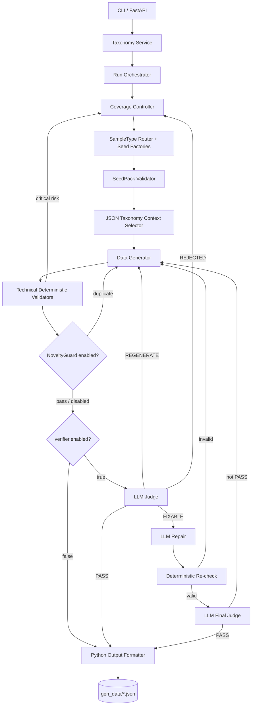

# PII Data Factory v2

## 1. Tổng quan

PII Data Factory tạo dữ liệu PII tổng hợp phục vụ huấn luyện và kiểm thử mô hình
Named Entity Recognition. Luồng hiện tại là một modular monolith chạy từ CLI hoặc
FastAPI: đọc taxonomy, lập kế hoạch sample, sinh dữ liệu bằng Azure OpenAI, kiểm tra
deterministic và xuất JSON có offset. NoveltyGuard cùng LLM Judge/Repair là quality
checks độc lập; config mẫu bật Gemini 2.5 Pro Judge cho mọi candidate online.
Offline chỉ là smoke test và không được dùng làm dataset.

Hệ thống không sử dụng dữ liệu cá nhân thật. Faker và các controlled factory chỉ tạo
seed tổng hợp; Generator phải dùng seed đã được validate.

## 2. Phạm vi đã triển khai



Luồng quality-first của config mẫu:

```text
Generator
  → Technical Deterministic Validators
  → Gemini 2.5 Pro Judge
  → optional Repair + re-check + final Judge
  → Python Output Formatter
  → gen_data
```

`verifier.enabled` điều khiển Judge/Repair. Cờ legacy
`validation.quality_checks_enabled` chỉ còn điều khiển NoveltyGuard và được migrate
sang `verifier.enabled` khi config cũ không khai báo `verifier`. Dù Judge tắt,
Formatter không bao giờ được bỏ qua technical validation.

## 3. Các module

### 3.1 Entry point và API

Các file chính:

- `pii_factory/main.py`: CLI, import taxonomy JSON và chạy đến khi run hoàn tất.
- `pii_factory/api.py`: FastAPI.
- `pii_factory/bootstrap.py`: nối các service và infrastructure adapter.

Các endpoint hiện có:

```text
GET  /
GET  /health
GET  /api/v1/taxonomies
GET  /api/v1/taxonomies/{version_id}
POST /api/v1/runs
POST /api/v1/taxonomies/{version_id}/runs
GET  /api/v1/runs/{run_id}
GET  /api/v1/runs/{run_id}/tasks
POST /api/v1/runs/{run_id}/generate?limit=5
GET  /api/v1/runs/{run_id}/events
```

Khi API khởi động, taxonomy canonical được đọc từ `PII_TAXONOMY_PATH` hoặc
`pii_taxonomy_rules.json`. `POST /api/v1/runs` nhận trực tiếp `RunConfig` và dùng
taxonomy version mặc định này.

`limit` là số sample đã accept cần trả về, không phải số request LLM tối đa. Một
sample có thể cần nhiều Generator attempt và, khi Verifier bật, nhiều Verifier
call.

Lỗi hạ tầng Verifier trả HTTP `503` mà không tiêu hao Generator attempt khi quality
gate được bật.

### 3.2 Taxonomy Service

`pii_factory/application/taxonomy_service.py`:

- đăng ký snapshot taxonomy có version;
- kiểm tra label của run;
- trả definition, rule và examples đúng cho task;
- phát event liên quan đến taxonomy.

`pii_factory/infrastructure/json_taxonomy.py` dùng Pydantic đọc trực tiếp
`pii_taxonomy_rules.json`. File này là nguồn taxonomy runtime duy nhất và hiện có
44 label; mỗi label phải có ít nhất ba example cho từng nhóm `POSITIVE`,
`PURE_NEGATIVE` và `HARD_NEGATIVE`.

Label từ tài liệu hard-negative bên ngoài không được thêm vào hệ thống. Chỉ label có
trong taxonomy snapshot của run được sử dụng.

### 3.3 Coverage Controller

`CoverageController` tạo `GenerationTask` theo:

- difficulty distribution;
- sample type distribution;
- optional constraints;
- exact seeded quota cho `short/medium/long`;
- sample structure cố định của run;
- focus label và robin labels;
- entity/complexity limits;
- deterministic `random_seed`.

Preset độ dài:

| Structure | short | medium | long |
|---|---:|---:|---:|
| Contract | 80–120 từ, 3–5 content units | 150–230 từ, 6–9 units | 260–400 từ, 10–14 units |
| Chat | 80–120 từ, 6–8 lượt | 150–230 từ, 10–14 lượt | 260–400 từ, 16–22 lượt |
| Custom | 80–120 từ | 150–230 từ | 260–400 từ |

Planner dùng largest-remainder quota rồi shuffle bằng `random_seed`; với 10 mẫu và
distribution `0.2/0.5/0.3`, quota luôn là `2/5/3`.

Mỗi task ban đầu có `slot_no`. Nếu task hết Generator attempt, task thay thế:

- giữ nguyên `slot_no`;
- giữ focus labels, difficulty, sample type và constraints;
- nhận task ID, seed và context mới;
- tăng `replacement_no`.

Run chỉ `COMPLETED` khi mỗi slot có một sample `ACCEPTED`.

### 3.4 Seed generation

`SampleTypeRouter` chọn factory:

- `positive`: tạo positive seed bằng Faker/controlled entity factories;
- `pure_negative`: dùng vocabulary an toàn, không có positive PII;
- `hard_negative/decoy_only`: chỉ có decoy không gắn tag;
- `hard_negative/mixed_contrastive`: có positive PII và decoy dễ nhầm.

`SeedPackValidator` kiểm tra:

- label thuộc taxonomy;
- positive value không trùng trong cùng completion;
- format đặc thù của label;
- seed không chứa mixed locale/placeholder;
- decoy strategy tồn tại;
- decoy không va chạm positive seed hoặc label cấu trúc khác;
- required/forbidden context cues.

PERSON dùng bộ họ, tên đệm và tên Việt có uniqueness guard; không dùng Faker name
có khả năng tạo tên lai như “Lê Jane”. Địa chỉ đầy đủ được tách thành:

- `ADDRESS`: số nhà, đường, tòa, căn hộ hoặc phòng;
- `LOCATION`: phường, quận/huyện, tỉnh/thành phố hoặc quốc gia;
- `ZIP_CODE`: span bưu chính độc lập.

### 3.5 JSON Taxonomy Context Selector

`pii_factory/application/taxonomy_context.py` tạo context có cấu trúc cho từng task:

- label neo nhận `definition`, `rule` và đúng ba example tương ứng với
  `task.sample_type` đã được random;
- robin labels chỉ nhận `definition` và `rule`;
- nếu một nhóm có hơn ba example, selector dùng `task.random_seed` để chọn ba mẫu
  có thể tái lập;
- context thực tế được lưu trong `taxonomy_context_used`.

Đây là lookup deterministic theo label, không phải semantic retrieval và không dùng
embedding model.

### 3.6 Data Generator

Generator nhận:

- `GenerationTask`;
- validated `SeedPack`;
- `ContextFrame`;
- structured taxonomy guidance;
- reflection feedback của attempt trước.
- `sample_structure` và structure variant đã được lập kế hoạch.
- `length_target` có giới hạn từ và content-unit/turn cụ thể.
- số entity bắt buộc bằng đúng số positive seed của task.

Ba structure được hỗ trợ:

- `contract`: fragment tài liệu doanh nghiệp/hành chính, gồm điều khoản, hồ sơ,
  thông báo nội bộ hoặc biên bản bàn giao;
- `chat`: hội thoại đúng hai người, giữa bạn bè hoặc khách hàng–nhân viên hỗ trợ;
- `custom`: làm theo `custom_instruction` về bối cảnh và hình thức trình bày.

`custom_instruction` là untrusted data và không được ghi đè taxonomy, label,
sample type, seed/decoy, annotation hoặc output contract.

Generator chỉ:

1. xây system/user prompt;
2. gọi Azure OpenAI;
3. parse `tagged_text` và `entities`;
4. tạo `GenerationCandidate`;
5. tính token/cost của Generator;
6. phát `data.generated`.

Generator không quyết định candidate có được accept hay không.

Few-shot chỉ dạy ngữ nghĩa label và ranh giới annotation. Prompt version
`data-generator.v10.0.0` cấm sao chép hoặc paraphrase gần scenario, actor, action,
opening phrase, clause order và sentence structure của example.
Prompt cấm ghép seed thành danh sách dấu phẩy; mỗi entity phải có vai trò nghiệp vụ
và được phân bố qua nhiều câu/lượt trong cùng một sự kiện.

Output thô:

```json
{
  "tagged_text": "Chị <PERSON>Lò Thị Cẩy</PERSON> đã gửi hồ sơ.",
  "entities": [
    {
      "label": "PERSON",
      "value": "Lò Thị Cẩy"
    }
  ]
}
```

### 3.7 Deterministic Validators

Technical gate luôn chạy trước Formatter:

- schema/tag syntax;
- entity metadata khớp tag;
- allowed/focus labels;
- entity count;
- clean-text word count đúng `length_target` trong online mode;
- positive seed xuất hiện đúng một lần và nguyên văn;
- decoy luôn untagged và có context cue;
- pure-negative/hard-negative structured PII scan;
- structured PII scan cho negative sample.
- `FewShotImitationGuard` che tagged entity rồi so sánh sequence/token n-gram với
  ba focus examples; candidate quá giống phải regenerate ngay cả khi Judge
  đang tắt.

Khi `quality_checks_enabled=true`, NoveltyGuard mới kiểm tra duplicate entity value
và sentence/entity novelty trong cùng run.

`DeterministicIssueRouter` ánh xạ kết quả theo route rõ ràng:

- `FIXABLE`: chỉ lỗi metadata cục bộ; chuyển cho Judge/Repair nếu Verifier
  bật, nếu không thì regenerate;
- `REGENERATE`: lỗi tag, semantic, seed/decoy, novelty hoặc structured PII;
- `REJECTED`: credential/real-PII risk severity `critical`.

Candidate cần regenerate tạo reflection feedback và quay lại Generator. Với lỗi scope
`SEEDS` hoặc `CONTEXT`, `RegenerationRouter` tạo seed/context mới theo đúng scope.

### 3.8 LLM Verifier

Verifier dùng cùng endpoint nhưng có model, prompt và sampling config riêng. Module
này được gọi khi `verifier.enabled=true`; config mẫu dùng `gemini-2.5-pro` cho Judge
và Repair trong khi Generator dùng `gemini-2.5-flash`.

Judge kiểm tra word/turn target, đủ 5–8 positive entity theo task, độ tự nhiên,
duplicate skeleton, seed/decoy contract, few-shot imitation và boundary
`ADDRESS/LOCATION/ZIP_CODE`. Deterministic issue là bằng chứng bắt buộc: Judge không
được trả `PASS` khi danh sách này còn issue.

Judge chỉ đánh giá, không được sửa:

```json
{
  "status": "FIXABLE",
  "score": 84,
  "issues": [
    {
      "type": "BOUNDARY",
      "severity": "low",
      "field": "tagged_text",
      "reason": "Boundary chứa dấu câu.",
      "suggested_fix": "Đưa dấu câu ra ngoài tag."
    }
  ]
}
```

Trạng thái:

- `PASS`: `issues` bắt buộc rỗng;
- `FIXABLE`: chỉ được chứa issue severity `low`;
- `REGENERATE`: lỗi ngữ nghĩa, label, hard-negative, độ tự nhiên hoặc difficulty;
- `REJECTED`: phải có issue `critical`, ví dụ credential/real-PII risk.

Luồng lỗi nhẹ:

```text
Judge FIXABLE
  → Repair sửa candidate trực tiếp
  → kiểm tra seed/decoy preservation
  → Deterministic re-check
  → Judge lần cuối
  → chỉ PASS mới được formatter
```

Repair không được thay:

- positive seed;
- decoy value hoặc số lần xuất hiện;
- focus labels;
- sample type;
- ý nghĩa task.

Response LLM là untrusted input. Pydantic dùng `extra = forbid`; response có field dư,
status mâu thuẫn hoặc schema sai được xem là lỗi hạ tầng. Candidate và taxonomy
guidance được đặt trong JSON envelope và không có quyền ghi đè system instructions.

### 3.9 Output Formatter

`pii_factory/application/formatting.py` hoàn toàn deterministic:

- parse XML-like tags;
- loại tag;
- kiểm tra unknown/nested/malformed tag;
- kiểm tra metadata khớp chính xác tagged spans;
- tính offset bằng Python Unicode code-point;
- `end` là exclusive;
- chặn empty/overlapping spans;
- xác minh `sample.text[start:end] == entity.text`.

Output cuối:

```json
[
  {
    "entities": [
      {
        "label": "PERSON",
        "start": 4,
        "end": 14,
        "text": "Lò Thị Cẩy"
      },
      {
        "label": "ETHNICITY",
        "start": 24,
        "end": 28,
        "text": "Cống"
      },
      {
        "label": "CARD_ISSUER",
        "start": 42,
        "end": 50,
        "text": "Agribank"
      }
    ],
    "text": "Chị Lò Thị Cẩy, dân tộc Cống, vay vốn tại Agribank."
  }
]
```

Pure-negative:

```json
[
  {
    "entities": [],
    "text": "Bộ phận kỹ thuật đã chuyển biểu mẫu sang bước tiếp theo."
  }
]
```

### 3.10 Dataset writer

`JsonDatasetWriter`:

- ghi UTF-8;
- `ensure_ascii=false`;
- ghi file atomically trong cùng thư mục;
- sanitize `run_name` để không path traversal;
- ghi tiến độ vào
  `gen_data/{safe_run_name}-{run_id}.partial.json`;
- chỉ đổi thành
  `gen_data/{safe_run_name}-{run_id}.json`
  khi đủ `num_samples`.

Nếu replacement budget cạn:

- run chuyển `FAILED`;
- không công bố file `.json` hoàn chỉnh;
- file `.partial.json` đã có vẫn là artifact chẩn đoán, không phải dataset final.

## 4. Pydantic contracts

Các schema chính trong `pii_factory/domain/models.py`:

```text
RunConfig
TaxonomySnapshot / TaxonomyLabel
GenerationTask
SeedPack / PositiveEntitySeed / DecoySeed
GenerationCandidate
DeterministicValidationResult
SampleStructureConfig
VerificationIssue / VerifierDecision
RepairResult / VerificationTrace
FormattedEntity / FormattedSample
TokenUsage / PipelineTokenUsage
DataGenerationResult
```

`DataGenerationResult` giữ các field Generator cũ và bổ sung:

```text
verification_trace
formatted_sample
pipeline_token_usage
```

`verification_trace` là `null` khi `verifier.enabled=false`.

`token_usage` cũ là usage của Generator attempt đã accept.
`pipeline_token_usage.total` gồm:

- toàn bộ Generator attempt của logical slot;
- Judge call nếu Verifier bật;
- Repair call nếu phát sinh;
- final Judge call nếu phát sinh;
- call đã trả response có schema lỗi nhưng vẫn phát sinh token.

File dataset cuối không chứa diagnostic, prompt, cost hoặc taxonomy context.

## 5. Run config

Ví dụ đầy đủ nằm tại `configs/run_config.example.json`.

Các field chính:

| Field | Ý nghĩa |
|---|---|
| `run_name` | Tên run và thành phần của output filename |
| `num_samples` | Số sample `ACCEPTED` bắt buộc |
| `language` | Ngôn ngữ, `vietnamese` được normalize thành `vi` |
| `minimum_per_label` | Coverage tối thiểu |
| `batch_size` | Số sample accept tối đa mỗi `generate_pending` |
| `focus_label` | Anchor label bắt buộc ở mọi sample |
| `robin_labels` | Pool label phụ trợ |
| `robin_selection` | Số robin label được random cho mỗi task |
| `focus_labels` | Chế độ legacy: pool focus labels |
| `difficulty_distribution` | Xác suất easy/medium/hard |
| `sample_type_distribution` | Xác suất positive/pure-negative/hard-negative |
| `sample_length_distribution` | Quota short/medium/long; đủ đúng ba key và tổng bằng 1 |
| `sample_structure` | Một trong `contract`, `chat`, `custom` cho toàn run |
| `optional_constraint_distribution` | Xác suất `teen_code`, `light_typo`, `abbreviation` |
| `max_entities` | Entity limit theo difficulty |
| `max_regenerate_attempts` | Số lần sinh lại trong cùng task |
| `max_task_replacements` | Số task thay thế tối đa cho mỗi slot |
| `faker` | Locale và seed-pack retry |
| `hard_negative` | Mode, decoy count và focus limits |
| `complexity_limits` | Complexity budget theo sample type |
| `validation.quality_checks_enabled` | Cờ legacy cho NoveltyGuard; migrate sang Verifier nếu config không có `verifier` |
| `verifier.enabled` | Bật/tắt LLM Judge/Repair; config mẫu bật |
| `verifier.max_repairs_per_candidate` | Hiện chỉ cho phép `0` hoặc `1` |
| `parallel_generation` | Số worker, kích thước shard và số lần retry mỗi shard |
| `random_seed` | Tái lập task/seed selection |

Trong anchor mode:

- `focus_label` luôn là positive entity trung tâm;
- `pure_negative` phải bằng `0`;
- hard-negative phải dùng `mixed_contrastive`;
- robin label được chọn ngẫu nhiên, không lặp trong cùng task.
- `1 + robin_selection.max_per_sample` không được vượt capacity; config sai bị từ
  chối thay vì âm thầm cắt số label.

Ví dụ structure:

```json
{
  "sample_structure": {
    "type": "custom",
    "custom_instruction": "Biên bản bàn giao thiết bị theo dạng checklist"
  }
}
```

`custom_instruction` bắt buộc với `custom` và bị từ chối với `contract` hoặc `chat`.
Các field validation cũ vẫn được parse để tương thích. Seed/tag/decoy/metadata/offset
và online length validation
không thể tắt.

## 6. Azure/OpenAI settings

Không ghi API key vào source hoặc README. Online mode đọc:

```dotenv
OPENAI_API_KEY=<secret>
BASE_URL=https://<resource>.openai.azure.com
OPENAI_API_STYLE=auto
API_VERSION=2024-08-01-preview
MODEL=gemini-2.5-flash
GENERATOR_MODEL=gemini-2.5-flash
VERIFIER_MODEL=gemini-2.5-pro
DEPLOYMENT_NAME=gpt-4o
TEMPERATURE=0.2
MAX_TOKENS=6000

VERIFIER_TEMPERATURE=0.0
VERIFIER_JUDGE_MAX_TOKENS=4000
VERIFIER_REPAIR_MAX_TOKENS=2500

LLM_TIMEOUT_SECONDS=120
LLM_INFRA_MAX_RETRIES=3
INPUT_TOKEN_PRICE_PER_MILLION_USD=2.50
OUTPUT_TOKEN_PRICE_PER_MILLION_USD=10.00
GEN_DATA_DIR=gen_data
```

`GENERATOR_MODEL` được dùng cho Data Generator. `VERIFIER_MODEL` được dùng cho
Judge và Repair. `MODEL` là fallback tương thích khi một trong hai biến theo vai
trò bị thiếu.

`OPENAI_API_STYLE=auto` dùng Azure deployment route và header `api-key` cho
hostname Azure OpenAI native; với gateway tùy chỉnh, client dùng
`/chat/completions`, header Bearer và gửi model đúng theo vai trò trong request.
Có thể ép `azure` hoặc `openai` nếu gateway không thể nhận diện đúng bằng
hostname.

Khi Verifier bật, Verifier transport/contract failure:

- retry theo infrastructure policy;
- không tăng Generator `attempt_no`;
- reuse candidate đã lưu;
- không đưa raw critical candidate vào reflection.

Offline mode dùng `OfflineCompletionClient` và `OfflineVerifierClient`, không gọi
Azure nên không phát sinh hóa đơn. Artifact được ghi dưới
`gen_data/offline-smoke/`; CLI cảnh báo đây không phải dataset. Verifier cost bằng
`0`; Generator vẫn trả token count và `money_cost` mô phỏng để kiểm thử accounting.

## 7. Chạy hệ thống

### 7.1 Tạo virtual environment và cài project

```powershell
py -3.11 -m venv .venv
& '.\.venv\Scripts\Activate.ps1'
python -m pip install -e .
```

Trong workspace hiện tại executable nằm trong `.venv\bin`.

### 7.2 Chạy API offline

```powershell
& '.\.venv\bin\pii-factory.exe' --offline
```

Mở:

```text
http://127.0.0.1:8000/docs
```

### 7.3 Chạy taxonomy JSON offline để smoke test

```powershell
& '.\.venv\bin\pii-factory.exe' `
  --offline `
  --config configs\run_config.example.json
```

Chọn taxonomy hoặc output directory khác:

```powershell
& '.\.venv\bin\pii-factory.exe' `
  --offline `
  --taxonomy-json pii_taxonomy_rules.json `
  --samples 2 `
  --focus-labels TIME `
  --output-dir gen_data
```

CLI in:

- run status;
- output path;
- accepted sample count;
- input/output/total tokens;
- `money_cost`;
- diagnostics: candidate bị loại, deterministic/Verifier rejection, task replacement,
  verification outcome và issue-type counts;
- các formatted sample.

### 7.4 Chạy online

Bỏ `--offline`:

```powershell
& '.\.venv\bin\pii-factory.exe' `
  --config configs\run_config.example.json
```

Online mode gọi Generator và Verifier nên phát sinh chi phí.

Để chạy config theo nhiều shard song song và chỉ publish khi đủ toàn bộ sample:

```powershell
& '.\.venv\bin\pii-factory-parallel.exe' `
  --config configs\run_config.example.json
```

Mỗi shard dùng một `random_seed` độc lập. Runner kiểm tra số lượng, schema, offset
và duplicate text trước khi ghi một file JSON hợp nhất vào `gen_data`.

## 8. State và events

Run status:

```text
CREATED → RUNNING → COMPLETED
                  └→ FAILED
```

Task status:

```text
CREATED
→ GENERATING
→ GENERATED
→ VALIDATING
→ VERIFYING
→ optional REPAIRING
→ FORMATTING
→ ACCEPTED

hoặc REJECTED → replacement task
```

Các event chính:

```text
run.created
generation.task.created
seed.validated / seed.rejected
data.generated
data.deterministic.validated
data.generation.rejected
data.verification.judged / rejected  # chỉ khi verifier.enabled=true
sample.formatted
sample.accepted
generation.task.replaced
generation.task.rejected
run.completed / run.failed
```

Repository và EventBus hiện là thread-safe in-memory adapter. Restart process không
khôi phục run đang chạy.

## 9. Kiểm thử

Project dùng `unittest`, không yêu cầu pytest:

```powershell
& '.\.venv\bin\python.exe' -m unittest discover -s tests -q
```

Test suite bao phủ:

- taxonomy JSON và structured context selector;
- distributions/focus/robin config;
- contract/chat/custom sample structures;
- Faker/seed/hard-negative strategies;
- deterministic validators;
- novelty/diversity;
- Verifier contract và bốn verdict;
- Judge → Repair → re-check → final Judge;
- repair thay seed/decoy bị chặn;
- verifier infrastructure retry không tăng Generator attempt;
- replacement task và replacement budget;
- pipeline cost;
- Unicode/emoji offsets;
- partial/final JSON writer;
- offline end-to-end.
- Verifier disabled vẫn giữ technical gate.
- exact length quota, numeric word target và entity density;
- PERSON thuần Việt và ADDRESS/LOCATION/ZIP_CODE boundary.

## 10. Giới hạn hiện tại và hướng production

Chưa triển khai:

- PostgreSQL persistence;
- RabbitMQ/Redis Streams;
- transactional outbox và DLQ;
- distributed worker deployment;
- vector database/embedding retrieval;
- human review UI;
- authentication/RBAC;
- semantic duplicate detection bằng embedding;
- resume run sau khi process restart.

Các thành phần trên là hướng production tương lai, không phải dependency runtime của
repository hiện tại.

Rủi ro còn lại:

- chất lượng phụ thuộc taxonomy, model và prompt;
- Generator và Verifier vẫn có thể có correlated model-family bias;
- LLM Verifier tùy chọn không thay thế human review cho dataset quan trọng;
- bật Verifier làm tăng latency/cost ở sample cần Repair;
- real-PII detection rule-based không thể đảm bảo tuyệt đối;
- JSON offset dùng Python code point; consumer dùng UTF-16 phải tự chuyển index.

## 11. Tiêu chí hoàn thành một run

Run chỉ được xem là thành công khi:

- có đúng `num_samples` sample `ACCEPTED`;
- mọi sample deterministic-valid;
- nếu Verifier bật, mọi sample có Judge cuối `PASS`;
- mọi formatted span thỏa `text[start:end] == entity.text`;
- không có task slot bị cạn replacement budget;
- file `.json` final đã được publish atomically;
- token và money cost được tổng hợp cho toàn bộ logical slot.
